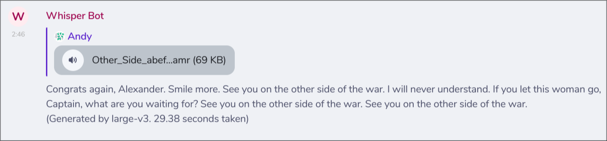

# mau_whisper

A [maubot](https://github.com/maubot/maubot) that transcribe audio in a room using [whisper.cpp](https://github.com/absadiki/pywhispercpp).



## Getting Started

Check [maubot documentation](https://docs.mau.fi/maubot/dev/getting-started.html) for build and installation.
Prebuilt binaries produced by [GitHub workflow](./.github/workflows/release.yml) can be found in [release page](https://github.com/hafeoz/waylrc/releases/latest).

## Configuration

```yaml
# A comma-separated list of whisper model names or `ggml` model path.
#
# If more than one model is listed, they will be used sequentially.
# Transcription will be available when first model finishes, and
# later models will replace the transcription (hopefully with more accurate text).
#
# Names of the model can be found from https://absadiki.github.io/pywhispercpp/#pywhispercpp.constants.AVAILABLE_MODELS
models: small,large-v3-turbo,large-v3

# The directory where the models are stored, or where they will be downloaded if they don't exist.
# model_dir: /var/cache

# Default reply when the transcription model has yet finished
# default_msg: "transcribing..."

# Append transcription with used model name and statistics
append_model: true

# Separator to use when combining audio segments. Typical values are ' ', '\n', etc.
# Default: no separator
# segment_separator: ""

# Text format for each segment.
# Follows `str.format()` syntax: https://docs.python.org/3/library/string.html#formatstrings
# Available variables: t0 (start time), t1 (end time), text
# Default: text only
# segment_formatter: "{text}"

# Language of the audio. Leave empty for auto-detection.
# Possible values: 'en', 'zh', 'de', 'es', 'ru', 'ko', 'fr', 'ja', 'pt', 'tr', 'pl', 'ca', 'nl', 'ar', 'sv', 'it', 'id', 'hi', 'fi', 'vi', 'he', 'uk', 'el', 'ms', 'cs', 'ro', 'da', 'hu', 'ta', 'no', 'th', 'ur', 'hr', 'bg', 'lt', 'la', 'mi', 'ml', 'cy', 'sk', 'te', 'fa', 'lv', 'bn', 'sr', 'az', 'sl', 'kn', 'et', 'mk', 'br', 'eu', 'is', 'hy', 'ne', 'mn', 'bs', 'kk', 'sq', 'sw', 'gl', 'mr', 'pa', 'si', 'km', 'sn', 'yo', 'so', 'af', 'oc', 'ka', 'be', 'tg', 'sd', 'gu', 'am', 'yi', 'lo', 'uz', 'fo', 'ht', 'ps', 'tk', 'nn', 'mt', 'sa', 'lb', 'my', 'bo', 'tl', 'mg', 'as', 'tt', 'haw', 'ln', 'ha', 'ba', 'jw', 'su'
language: ""

# Initial prompt for the model
# prompt = "以下是普通话的句子"
```

## License

This software is licensed under [BSD Zero Clause](https://spdx.org/licenses/0BSD.html) OR [CC0](https://spdx.org/licenses/CC0-1.0.html) OR [WTFPL Version 2](https://spdx.org/licenses/WTFPL.html).
You may choose any of them at your will.
